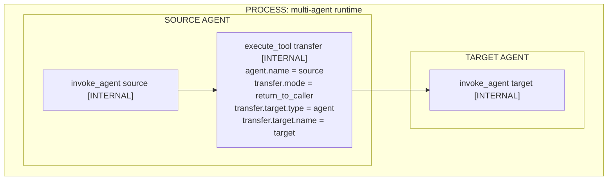
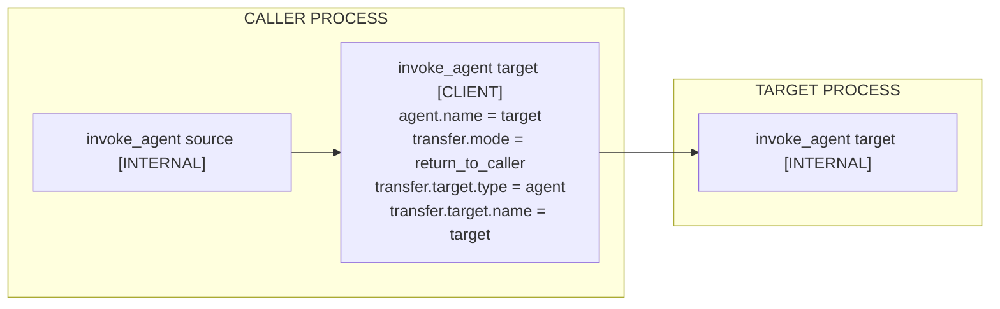

# Agent-to-agent interaction examples

This page illustrates how existing GenAI spans represent agent-to-agent
interactions. These examples are non-normative.

## Tool-based transfer

Some frameworks expose another agent as a tool. The framework records the tool
execution as an `execute_tool` span:

- `gen_ai.agent.*` identifies the source agent executing the tool.
- `gen_ai.transfer.target.*` identifies the target agent.
- `gen_ai.transfer.mode` describes whether control returns to the source agent
  or passes to the target.

The target agent's execution can be recorded as a separate `invoke_agent`
INTERNAL span when it is observable.

For a transfer that does not return control to the source agent, the
`execute_tool` span instead records:

| Property | Value |
| --- | --- |
| `gen_ai.agent.name` | `"source"` |
| `gen_ai.transfer.mode` | `"pass_control"` |
| `gen_ai.transfer.target.name` | `"target"` |
| `gen_ai.transfer.target.type` | `"agent"` |

## Agent invocation through an API or protocol

When an agent invokes another agent through an API or protocol, use the existing
`invoke_agent` CLIENT span. `gen_ai.agent.*` and
`gen_ai.transfer.target.*` both identify the invoked agent, while
`gen_ai.transfer.mode` describes the transfer behavior.

The target process can independently record the agent's execution as an
`invoke_agent` INTERNAL span. When trace context is propagated, that execution
can be a descendant of the CLIENT span.

These conventions do not require the target execution span or prescribe a
particular context-propagation mechanism.
