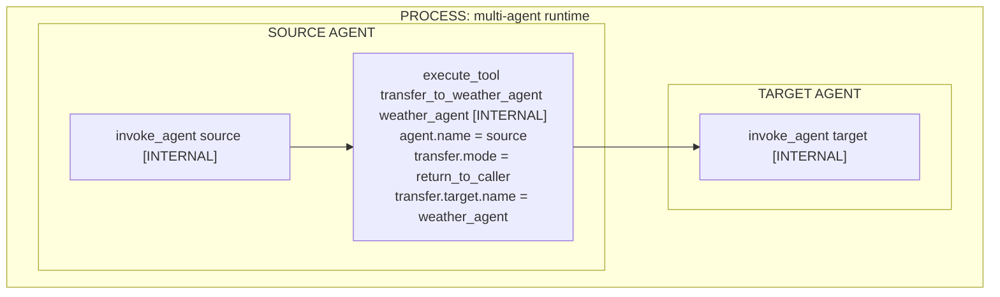
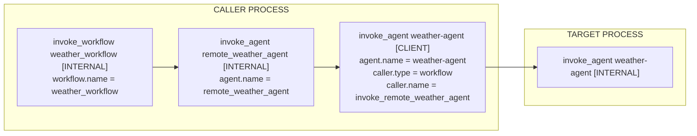

# Agent tool transfer and remote invocation examples

This page illustrates agent tool transfers and remote agent invocations with
existing GenAI spans. These examples are non-normative.

## Tool-based transfer

Some frameworks expose another agent as a tool. The framework records the tool
execution using the `gen_ai.execute_tool.transfer.internal`
[agent-as-a-tool refinement](../gen-ai-agent-spans.md#agent-as-a-tool)
of the generic `gen_ai.execute_tool.internal` span:

- `gen_ai.agent.*` identifies the source agent executing the tool.
- `gen_ai.transfer.target.name` identifies the target agent.
- `gen_ai.transfer.mode` describes whether control returns to the source agent
  or passes to the target.

The target agent's execution can be recorded as a separate `invoke_agent`
INTERNAL span when it is observable.

When the target name is available at span creation, a transfer to the weather
agent can use the span name
`execute_tool transfer_to_weather_agent weather_agent`. Frameworks that expose
the authoritative target only after the span starts use the fallback
`execute_tool transfer_to_weather_agent`.

```mermaid
flowchart LR
  subgraph P["PROCESS: multi-agent runtime"]
    direction LR
    subgraph S["SOURCE AGENT"]
      S1["invoke_agent source [INTERNAL]"]
      S2["execute_tool transfer_to_weather_agent weather_agent [INTERNAL]<br/>agent.name = source<br/>transfer.mode = return_to_caller<br/>transfer.target.name = weather_agent"]
      S1 --> S2
    end
    subgraph T["TARGET AGENT"]
      T1["invoke_agent target [INTERNAL]"]
    end
    S2 --> T1
  end
```

For a transfer that does not return control to the source agent, the
`execute_tool` span instead records:

| Property | Value |
| --- | --- |
| Span name | `execute_tool transfer_to_weather_agent weather_agent` |
| `gen_ai.agent.name` | `"source"` |
| `gen_ai.transfer.mode` | `"pass_control"` |
| `gen_ai.transfer.target.name` | `"weather_agent"` |

## Agent invocation through an API or protocol

When an agent invokes another agent through an API or protocol, use the existing
`invoke_agent` CLIENT span. `gen_ai.agent.*` identifies the invoked agent.
When the library explicitly exposes the immediate logical caller, record the
caller attributes on that span:

- `gen_ai.caller.type` identifies whether that caller is an agent or workflow.
- `gen_ai.caller.name` identifies the immediate logical caller.

Google ADK exposes the immediate caller before a `RemoteA2aAgent` sends its A2A
request. `Context.node` identifies a workflow step, while
`ToolContext.agent_name` identifies an agent using `AgentTool`. Framework
instrumentation can carry that caller to the A2A CLIENT span.

The local `RemoteA2aAgent` execution is an `invoke_agent` INTERNAL span, and the
protocol request is its `invoke_agent` CLIENT child. The caller attributes
preserve the logical workflow caller on the client request, while the parent
span represents the local `RemoteA2aAgent` execution.

The target process can record the agent's execution as an `invoke_agent`
INTERNAL span. Propagated trace context links that execution as a descendant of
the CLIENT span.

```mermaid
flowchart LR
  subgraph C["CALLER PROCESS"]
    C1["invoke_workflow weather_workflow [INTERNAL]<br/>workflow.name = weather_workflow"]
    C2["invoke_agent remote_weather_agent [INTERNAL]<br/>agent.name = remote_weather_agent"]
    C3["invoke_agent weather-agent [CLIENT]<br/>agent.name = weather-agent<br/>caller.type = workflow<br/>caller.name = invoke_remote_weather_agent"]
    C1 --> C2
    C2 --> C3
  end
  subgraph T["TARGET PROCESS"]
    T1["invoke_agent weather-agent [INTERNAL]"]
  end
  C3 --> T1
```
